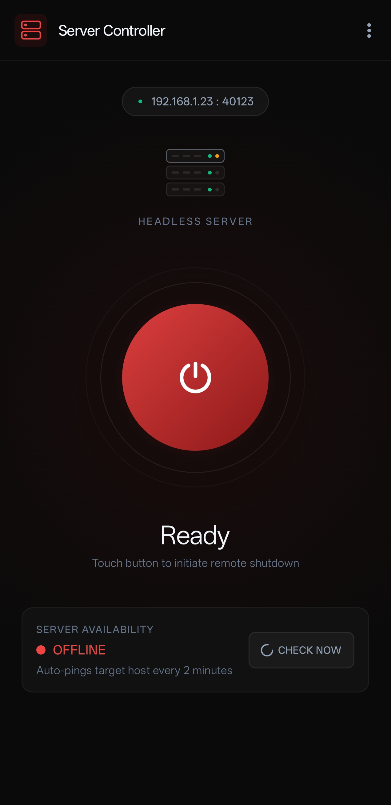
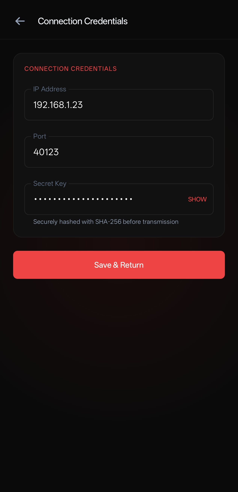
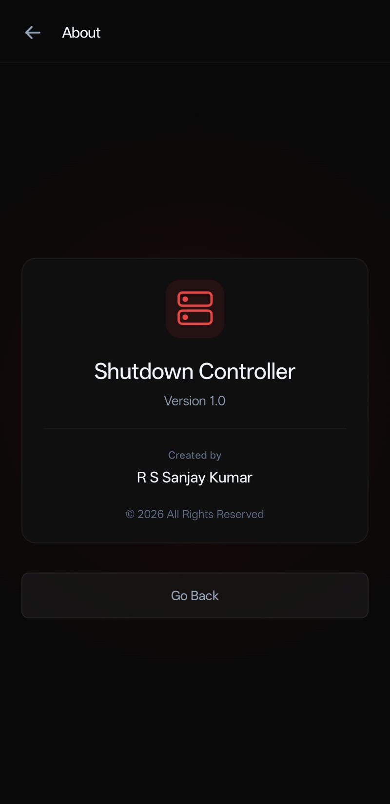

# Remote Shutdown Controller

A lightweight Android and Linux-based remote shutdown solution that allows a user to securely shut down a headless Linux server from an Android device connected to the same local network.

---

## Overview

Remote Shutdown Controller is designed for users who operate home servers, mini PCs, media servers, virtual machines, or headless Linux systems and want a quick way to remotely power them off without requiring SSH clients, remote desktop applications, or complex management software.

The Android application sends a pre-shared authentication token to the Linux server. The server validates the token and, if authentication succeeds, initiates a system shutdown.

The project is intended for trusted local networks and prioritizes simplicity, lightweight deployment, and ease of use.

---

## Features

* One-tap server shutdown
* Lightweight Bash-based server component
* No database required
* No external dependencies except Ncat
* Authentication using SHA-256 validation
* Automatic startup on boot using systemd
* Runs continuously as a background service
* Suitable for headless Linux systems
* Works entirely within a local network

---

## Screenshots

<table align="center">
<tr>
<td align="center">
<br>
<b>Home Screen</b>
</td>

<td align="center">
<br>
<b>Configuration Screen</b>
</td>

<td align="center">
<br>
<b>About Screen</b>
</td>
</tr>
</table>

---

## Architecture

```text
┌─────────────────┐
│ Android App     │
│                 │
│ Generate SHA256 │
│ Send Token      │
└────────┬────────┘
         │ TCP
         ▼
┌─────────────────┐
│ Linux Server    │
│                 │
│ Ncat Listener   │
│ Token Validation│
│ Shutdown Action │
└─────────────────┘
```
---

## Requirements

### Server

* Linux
* Bash
* Systemd
* Ncat

### Client

* Android 8.0+
* Same Local Network

---

# Installing Ncat

## Ubuntu/Debian

```bash
sudo apt update
sudo apt install ncat
```

---

## Fedora

```bash
sudo dnf install nmap-ncat
```

---

## Arch Linux

```bash
sudo pacman -S nmap
```

---

## Verify Installation

```bash
ncat --version
```

Expected output:

```text
Ncat: Version 7.x
```

---

# Server Installation

Create project directory:

```bash
sudo mkdir -p /opt/remote-shutdown-controller
```

Copy script:

```bash
sudo cp shutdown_listener.sh /opt/remote-shutdown-controller/
```

Make executable:

```bash
sudo chmod +x /opt/remote-shutdown-controller/shutdown_listener.sh
```

---

# Listener Script

Store the listener script at:

```text
/opt/remote-shutdown-controller/shutdown_listener.sh
```

---

# Configuring the Secret

Locate:

```bash
KEY="SecretKey@123"
```

Replace with your own secret key.

Example:

```bash
KEY="MySecureShutdownToken2026"
```

The Android application must use the same secret.

---

# Creating the Systemd Service

Create service file:

```bash
sudo nano /etc/systemd/system/remote-shutdown.service
```

Contents:

```ini
[Unit]
Description=Remote Shutdown Listener
After=network.target

[Service]
Type=simple
ExecStart=/opt/remote-shutdown-controller/shutdown_listener.sh
Restart=always
RestartSec=5
User=root

[Install]
WantedBy=multi-user.target
```
---

# Enable Service

Reload systemd:

```bash
sudo systemctl daemon-reload
```

Enable startup on boot:

```bash
sudo systemctl enable remote-shutdown.service
```

Start service:

```bash
sudo systemctl start remote-shutdown.service
```

---

# Service Management

Check status:

```bash
sudo systemctl status remote-shutdown.service
```

Restart:

```bash
sudo systemctl restart remote-shutdown.service
```

Stop:

```bash
sudo systemctl stop remote-shutdown.service
```

Disable:

```bash
sudo systemctl disable remote-shutdown.service
```

---

# Viewing Logs

Live logs:

```bash
journalctl -u remote-shutdown.service -f
```

Complete logs:

```bash
journalctl -u remote-shutdown.service
```

---

# Network Configuration

Default Listener Port:

```text
40123
```

If a firewall is enabled, allow inbound connections:

```bash
sudo ufw allow 40123/tcp
```

Verify:

```bash
sudo ufw status
```

---

# Security Notes

This project is intended for trusted local networks.

Current authentication uses a pre-shared SHA-256 token.

Recommended deployment:

* Home networks
* Laboratory environments
* Internal LANs
* Development systems

Not recommended for direct Internet exposure.

For Internet-facing deployments, consider:

* TLS Encryption
* Mutual Authentication
* HMAC-based requests
* VPN access
* Rate limiting

---

# Troubleshooting

### Service Will Not Start

Verify:

```bash
chmod +x shutdown_listener.sh
```

Verify path:

```bash
ls -l /opt/remote-shutdown-controller/
```

---

### Port Already In Use

Check:

```bash
sudo ss -tulpn | grep 40123
```

---

### Ncat Not Found

Verify:

```bash
which ncat
```

Install Ncat if missing.

---

### Authentication Fails

Ensure:

* Android app uses the correct secret
* SHA-256 implementation matches
* No extra spaces or newline characters are included

---

# License

Copyright © 2026 R S Sanjay Kumar

All Rights Reserved.
